<p align="center">
  
</p>

<h1 align="center">Open Local Assistant</h1>

<p align="center">
  A free, private desktop AI assistant for Windows. You can type or talk to it, and it can answer out loud.<br>
  It runs fully on your own PC through <a href="https://lmstudio.ai">LM Studio</a>, or on a hosted AI provider if you choose one. No sign-up, no telemetry.
</p>

<p align="center">
  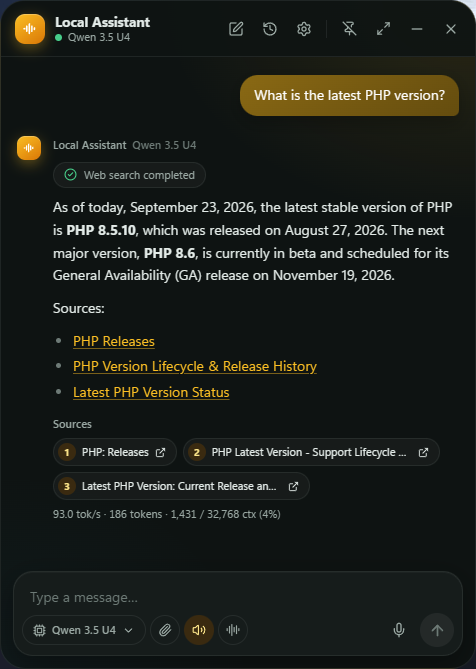
</p>

**Free and open source** under the [GPL-3.0 license](LICENSE). Download the Windows installer or the portable version from the [Releases](../../releases) page, or [build it yourself](#building-from-source).

**Windows only.** Bug reports, ideas and pull requests are welcome in [Issues](../../issues).

---

## Features

- **Local or hosted AI, your choice.** Use [LM Studio](https://lmstudio.ai) to keep everything on your PC. If your PC can't run models, connect OpenRouter, Google Gemini or Hugging Face with your own API key. A "free models only" filter hides models that cost money.
- **Floating chat window.** Press `Ctrl+Space` to open it. When you close it, it goes to the system tray.
- **Voice in and out.** Speak your question and hear the answer read back with local neural voices.
- **Hands-free calls.** A phone-call style screen with live captions, so you can talk without using the keyboard.
- **Dictation in any app.** Press a hotkey, speak, and the text is typed into Notepad, your browser, or whatever app has focus.
- **One voice model for every language.** A single small multilingual voice model (Supertonic 3, 123 MB, 31 languages) speaks English, Arabic, German and more. Arabic text is shown right-to-left.
- **Right-click any reply.** Select text in an answer, then right-click to hear it read aloud, get a short explanation in a pop-up, or ask about it as the next message in the same chat.
- **Web search with sources.** For "latest / today" questions the assistant searches the web and lists the pages it used.
- **MCP tools.** You can connect Model Context Protocol servers. Anything that writes data or runs commands asks you first.
- **Optional NVIDIA GPU pack** to speed up speech recognition and the voices.

## Download

Get the latest version from the [Releases](../../releases) page:

| File | What it is |
| --- | --- |
| `Open-Local-Assistant-<version>-setup.exe` | **Installer (recommended).** Installs to `C:\Program Files\Open Local Assistant` and adds a Start menu entry and an uninstaller. |
| `Open-Local-Assistant-<version>-portable-win-x64.zip` | **Portable version.** Extract the folder anywhere and run `Open Local Assistant.exe`. Keep the four `.dll` files next to the `.exe`. |

### "Windows protected your PC"

The builds are not code-signed yet. A code-signing certificate costs money every year, and this is a free app, so Windows SmartScreen doesn't recognise it and shows a warning. To run it, click **More info → Run anyway**. If you'd rather not, you can [build it yourself](#building-from-source) from this code.

### Check that a download is genuine

Every release file is built on GitHub from this repository, and GitHub attaches a signed record (a [build provenance attestation](https://docs.github.com/actions/security-for-github-actions/using-artifact-attestations), made with [Sigstore](https://www.sigstore.dev)) saying exactly which commit and build produced it. With the [GitHub CLI](https://cli.github.com) installed, run:

```powershell
gh attestation verify .\Open-Local-Assistant-<version>-setup.exe --repo kz370/Open-Local-Ai-Assistant
```

If the file was changed in any way, or wasn't built here, the check fails. This doesn't stop the SmartScreen warning, which only looks for a paid code-signing certificate.

Without the GitHub CLI, you can still compare the file's SHA-256 hash with the one shown next to it on the [Releases](../../releases) page:

```powershell
Get-FileHash .\Open-Local-Assistant-<version>-setup.exe
```

## Requirements

- Windows 10 or 11, 64-bit
- One AI provider:
  - **Local:** [LM Studio](https://lmstudio.ai) with at least one model downloaded and the **local server** turned on (default `http://localhost:1234`), or
  - **Hosted:** an API key from OpenRouter, Google Gemini or Hugging Face (free models are available)
- A microphone for voice features (optional)
- An NVIDIA GPU (optional)

### What PC do I need?

- **Hosted provider:** almost any Windows 10/11 PC. The AI runs on the provider's servers.
- **Local models through LM Studio:** as a rough guide, 16 GB of RAM for small models (3–4B). For 7–8B models, which answer noticeably better, an NVIDIA GPU with 8 GB or more of video memory keeps replies fast. Without a GPU, replies still work but come more slowly.
- **Voice features:** run on the CPU on any modern PC. The optional NVIDIA GPU pack makes them faster.

Local models are private but less capable than the big cloud assistants such as ChatGPT or Claude. They work well for everyday questions, writing help, explanations and dictation.

## Getting started

1. Pick your AI provider:
   - **Local:** install and open LM Studio, download a model, then start the local server from the **Developer** tab.
   - **Hosted:** create an API key at OpenRouter, Google AI Studio (Gemini) or Hugging Face.
2. Run the installer and launch **Open Local Assistant**.
3. The setup wizard finds LM Studio, your microphones and speakers. It also offers voice models that suit your hardware. Nothing is downloaded until you click **Download**.
4. Using a hosted provider? Open **Settings → AI provider**, choose the provider and paste your API key. The key is stored only on your PC.
5. Press `Ctrl+Space` and ask something.

<p align="center">
  
  &nbsp;
  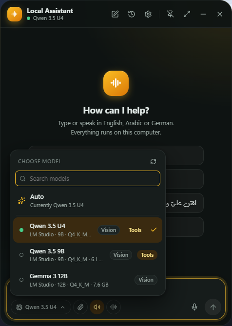
</p>

If you leave the model on **Auto**, the app uses the model that is already loaded in LM Studio. If none is loaded, it picks one that fits your GPU memory. You can also pick a model yourself at any time.

## Voice

<p align="center">
  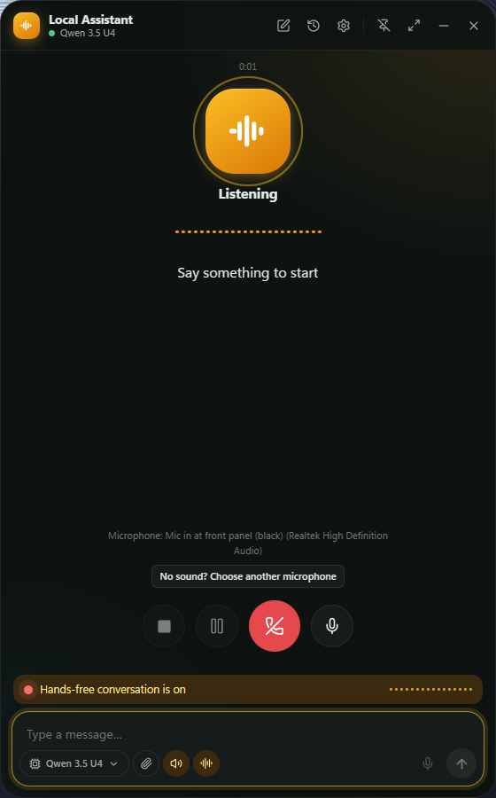
</p>

- **Push-to-talk:** hold `Ctrl+Shift+Space` while you speak.
- **Hands-free:** click the waveform button next to the message box. The call screen listens, answers, and highlights each word as it is spoken. You can pause, mute or end the call at any time.
- **Dictation:** press `Ctrl+Alt+Space` in any app. A small overlay shows your words live, and pressing the hotkey again inserts the text.

<p align="center">
  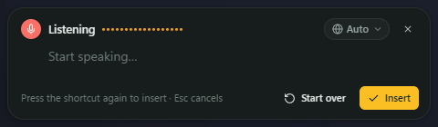
</p>

## Right-click a reply

Select any part of the assistant's answer and right-click it.

<p align="center">
  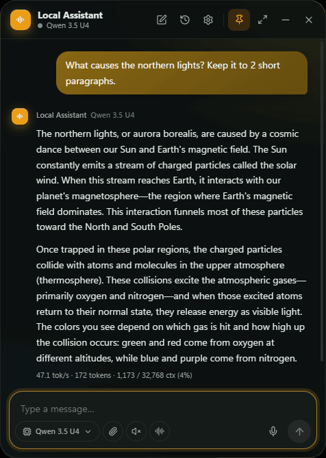
</p>

- **Speak** reads the selected text out loud.
- **Explain** opens a small pop-up with a short explanation of just that part, without leaving the answer.
- **Ask in chat** (in the pop-up) sends the selection as your next message, so the assistant explains it in more detail in the same conversation.

<p align="center">
  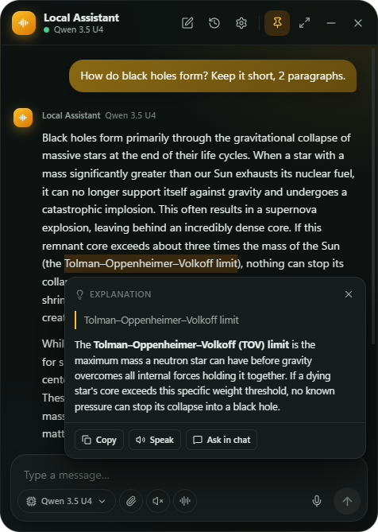
  &nbsp;
  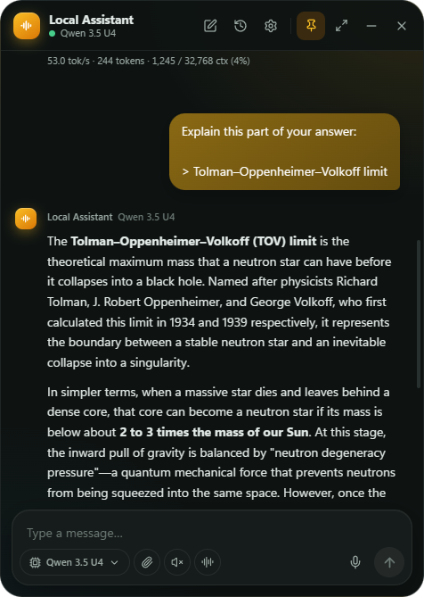
</p>

## Keyboard shortcuts

| Action | Default |
| --- | --- |
| Open / focus the assistant | `Ctrl+Space` |
| Push-to-talk (hold) | `Ctrl+Shift+Space` |
| Dictation into any app | `Ctrl+Alt+Space` |
| New conversation / History / Settings | `Ctrl+N` / `Ctrl+H` / `Ctrl+,` |

You can change all of them in **Settings → Keyboard Shortcuts**.

## Settings at a glance

| | |
| --- | --- |
| 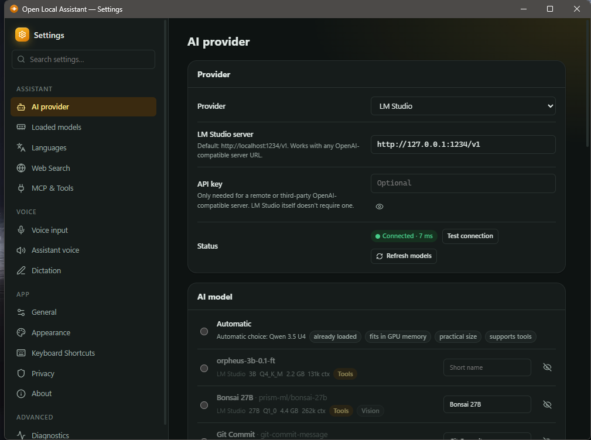 | 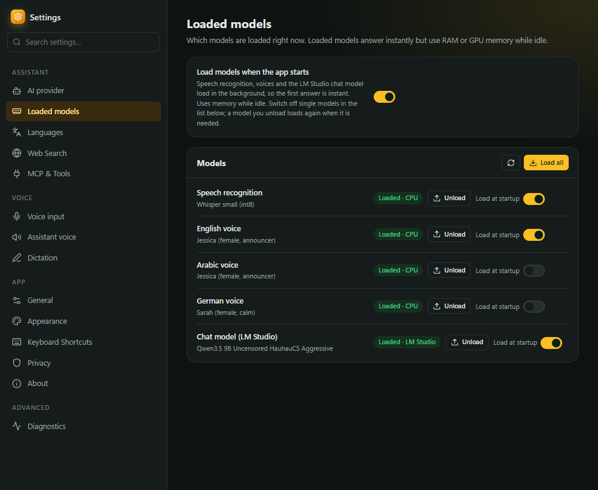 |
| **AI provider:** LM Studio or a hosted provider, API key, connection test, and a short display name for each model. | **Loaded models:** see what is in memory, load or unload it, and choose what loads at startup. |
| 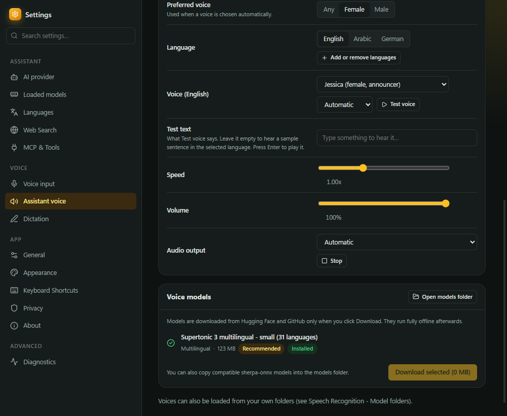 | 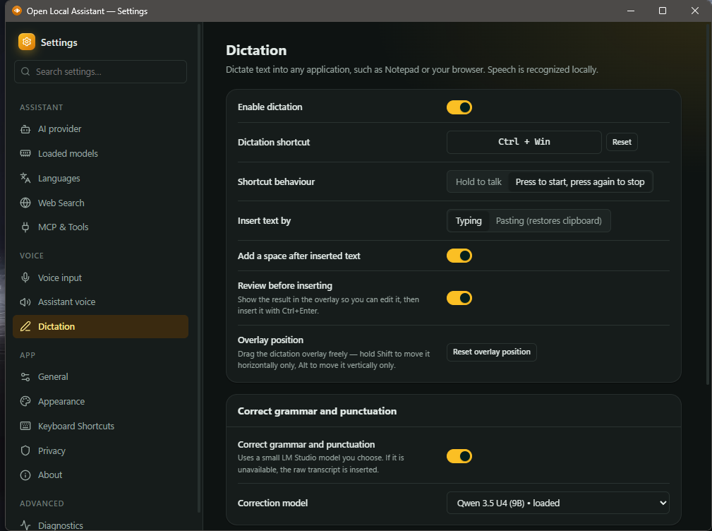 |
| **Assistant voice:** one multilingual voice model for all languages, a voice for each language, speed, volume and the GPU pack. | **Dictation:** hotkey behaviour, typing or pasting, review before inserting, and grammar cleanup. |

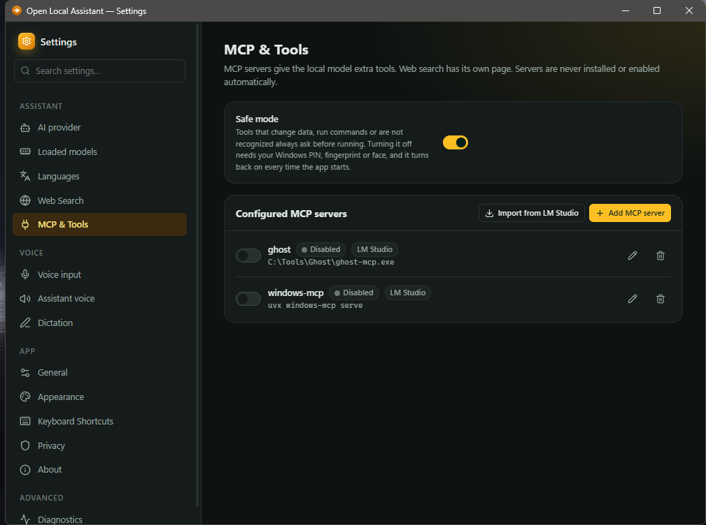

**MCP & Tools:** add MCP servers or import them from LM Studio. Safe mode is on by default, so risky tools always ask before they run.

## Using your own speech models

The app runs speech models in the [sherpa-onnx](https://github.com/k2-fsa/sherpa-onnx) format, such as Whisper, Parakeet/NeMo, SenseVoice, Moonshine, Kokoro and Piper. To add your own:

- copy the model folder into `%APPDATA%\com.localassistant.app\models`, or
- open **Settings → Voice input → Model folders → Add folder** and choose any folder. Hugging Face cache folders work too.

## Privacy

There is no account and no telemetry. Conversations, settings, API keys and logs are stored only on your PC, in `%APPDATA%\com.localassistant.app`. Nothing is sent anywhere except:

- your messages to the AI provider you chose. With LM Studio they stay on your PC. With OpenRouter, Google Gemini or Hugging Face they go to that company's servers, and the app shows a notice saying so,
- web searches, and only when the assistant uses the search tool,
- model downloads, and only when you click **Download**.

Speech recognition (including dictation) and the assistant's voice always run on your PC, whichever AI provider you use. Only the optional dictation grammar cleanup uses the AI model.

The full details, including every service the app can connect to, are in the [privacy policy](PRIVACY.md).

## Uninstall

Use **Settings → Apps → Installed apps → Open Local Assistant → Uninstall**. To also delete your conversations and downloaded models, remove `%APPDATA%\com.localassistant.app`.

## Troubleshooting

- **"LM Studio is unavailable"**: start the local server in LM Studio, then click **Test connection** in Settings → AI provider.
- **No models listed for a hosted provider**: check the API key in Settings → AI provider, then click **Refresh models**.
- **Replies are slow with LM Studio**: try a smaller model, or check that LM Studio is using your GPU. See [What PC do I need?](#what-pc-do-i-need)
- **Found a bug?** Open an [issue](../../issues) and say what you did, what you expected, and your Windows version.
- **No voice in a language**: open Settings → Assistant voice → Voice models and make sure the Supertonic 3 multilingual model is installed.
- **The app doesn't open**: it may already be running. Look for its icon in the system tray, or press `Ctrl+Space`.
- **Portable version won't start**: make sure the four `.dll` files are in the same folder as the `.exe`.

---

## Building from source

### Requirements

- Windows 10/11. It's the main target; the code should also build on macOS and Linux, but that isn't tested.
- [Node.js](https://nodejs.org) 20 or newer
- [Rust](https://rustup.rs) (stable, with the MSVC toolchain on Windows)
- The WebView2 runtime (already included in Windows 11)
- [Inno Setup 6](https://jrsoftware.org/isdl.php), only if you want to make the installer

The first build downloads the prebuilt static sherpa-onnx libraries from the sherpa-onnx GitHub releases. This happens at build time only.

### Run in development

```bash
npm install
npm run tauri dev
```

### Build the installer and the portable version

```bat
build-installer.bat
```

This builds the frontend and the release exe, then writes these to `release\`:

- `Open Local Assistant.exe` plus the four speech `.dll` files (the portable version)
- `Open-Local-Assistant-<version>-setup.exe` (needs Inno Setup)

When the build finishes, it asks whether to upload it as GitHub release `v<version>` (creating it, or replacing the files of an existing one). `build-installer.bat upload` uploads without asking, and `build-installer.bat noupload` never asks.

`build-installer.bat install` skips the installer and copies the app straight into `C:\Program Files\Open Local Assistant` (asks for administrator rights).

### Publish a release (maintainers)

1. Set the new version in `package.json`, `src-tauri/Cargo.toml` and `src-tauri/tauri.conf.json`.
2. Write the release notes in `release-notes/v<version>.md` and commit.
3. Push a tag: `git tag v<version>`, then `git push origin v<version>`.

The [build workflow](.github/workflows/build.yml) then builds the setup exe and the portable zip on GitHub, attests them with Sigstore, and publishes them as release `v<version>`. It stops if the tag doesn't match the version in `Cargo.toml`.

`upload-release.bat` (and the upload question at the end of `build-installer.bat`) can still publish a build from your own PC, for example to replace a release file quickly. Files uploaded that way have no attestation, so prefer the tag.

## Architecture

```
src/                         React + TypeScript UI (English only)
  app/                       typed IPC, zustand stores, UI strings
  components/ pages/         chat window, settings dashboard, setup wizard, dictation overlay
src-tauri/src/
  services/ai/               OpenAI-compatible client (SSE streaming, tool calls), automatic model selection
  services/chat/             orchestrator (history, tool rounds, permissions), prompt, freshness detection
  services/stt/              speech recognition, listening sessions (push-to-talk, hands-free VAD, dictation)
  services/tts/              sentence buffer, per-sentence language → voice selection, synthesis queue
  services/audio/            cpal capture (16 kHz mono) and playback queue
  services/language/         English/Arabic/German detection for typed and spoken text
  services/mcp/              MCP manager (stdio + streamable HTTP), permission policy, source extraction
  services/models/           voice model catalog, discovery, consented downloads
  services/search/           web search (SearXNG with DuckDuckGo fallback)
  services/dictation.rs      grammar cleanup with a small model, text insertion
  services/gpu/              optional CUDA pack for the speech models (download, install, activate)
  capabilities/              LocalCapabilityManager (scan of everything available locally)
  database/                  SQLite (conversations, messages + FTS5, settings, MCP config)
  desktop/                   tray, floating window placement and persistence, global shortcuts
```

### Key behaviours

- **Model selection:** loaded models win. Otherwise the app scores LM Studio models by whether they fit in VRAM (or RAM on machines without a GPU), how practical their parameter count is, whether they support tool use, their context size and their quantization. It does not simply pick the largest model. You can always choose a model manually. If you loaded the model in LM Studio yourself (for example with a draft model for speculative decoding), the app leaves it as is. It only loads a model itself when none is loaded yet.
- **Current information:** the system prompt tells the model to use a web-search tool for "latest / current / today" questions. If no search tool is enabled, the model must say it cannot verify current information. Sources shown in the UI come only from URLs the tools actually returned.
- **Stable system prompt:** the system prompt is identical from one turn to the next. The clock, the per-message language and the freshness hint are added to the latest user message instead. This keeps LM Studio's prompt cache valid, so it only reads your new message each turn instead of the whole conversation.
- **Tool security:** search, fetch and read tools are allowed by default. Tools that write data, and tools that can't be classified, always ask for confirmation. Command-execution tools are off by default and can never be set to run without confirmation. MCP servers are never installed or turned on automatically.
- **Streaming speech:** tokens are buffered into complete sentences. Code blocks are skipped, and decimals, abbreviations and URLs don't end a sentence. Each sentence is spoken as soon as it is complete, in a voice that matches its detected language.
- **GPU acceleration:** the optional CUDA pack speeds up the local speech models on an NVIDIA GPU. It is on by default once installed and falls back to the CPU if the GPU fails to start. The small voice-activity detector always runs on the CPU, because a GPU round-trip costs more than the calculation itself.

## Tests

```bash
# Rust unit and integration tests (LM Studio mock server, MCP fixture server over stdio, DB, language, TTS buffering)
cd src-tauri && cargo test

# Frontend tests (RTL rendering, streaming chat store, tool UI, shortcuts, every UI string key exists)
npm test

# Optional: real voice models (downloads about 560 MB into the given folder)
LA_MODELS_DIR=/path/to/models cargo test --test voice_models -- --nocapture

# Optional: live test against your running LM Studio (streaming, 3 languages, web-search tool use)
LA_LIVE_LMSTUDIO=1 cargo test --test lmstudio_live -- --nocapture
```

## Contributing

Bug reports and pull requests are welcome. For bigger changes, please open an issue first so we can agree on the approach. Run `npm test` and `cargo test` before sending a pull request.

## Code signing and build provenance

Windows releases are not code-signed: a trusted code-signing certificate costs money every year, and the free programs for open-source projects haven't accepted this project yet.

Instead, every release file is built from this repository by the public GitHub Actions workflow [`.github/workflows/build.yml`](.github/workflows/build.yml), and each file gets a Sigstore build provenance attestation. See [Check that a download is genuine](#check-that-a-download-is-genuine).

- **Maintainer:** [kz370](https://github.com/kz370) reviews every change and publishes every release.
- **Privacy:** see the [privacy policy](PRIVACY.md). The app sends nothing anywhere except for the features listed there, which the user chooses or starts.

## License

Open Local Assistant is free software, released under the [GNU General Public License v3.0](LICENSE). You can use, study, change and share it. If you share a changed version, you must release its source code under the same license.

It uses [sherpa-onnx](https://github.com/k2-fsa/sherpa-onnx) and [ONNX Runtime](https://github.com/microsoft/onnxruntime), which have their own licenses. Voice and speech models downloaded by the app are covered by their own licenses too.
