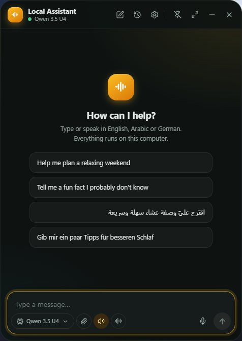

# Open Local Assistant

A small, fast, local-first desktop AI assistant. It lives in a floating window (bottom-right by default), runs in the system tray, and opens with a global shortcut. You can type or talk to it in **English, Arabic or German**, and it can answer out loud with natural local voices.

<!--
  Screenshots: none checked in yet. To add some, run the app, capture the
  chat window, the hands-free call screen and the Settings pages, save them
  under docs/screenshots/, and reference them here, e.g.:
  
-->

- **LLM:** LM Studio only (its local OpenAI-compatible server). No other LLM backend, no cloud fallback.
- **Windows:** a small floating bubble sits on your desktop. Click it (or press `Ctrl+Space`) to open the chat. `−` puts the chat back into the bubble, `X` closes it to the tray, and the app quits only from the tray menu. Only one instance runs at a time.
- **Speech recognition:** any sherpa-onnx compatible local model — Whisper, NeMo/Parakeet/Nemotron transducers (including streaming ones that show text live), NeMo CTC, SenseVoice, Moonshine and Paraformer — via [sherpa-onnx](https://github.com/k2-fsa/sherpa-onnx).
- **Text-to-speech:** local neural voices. Supertonic 3 (129 MB) is the default: one multilingual model with 10 voices (5 female, 5 male) that speaks English, Arabic and German. Kokoro English (bigger, very natural English voices) is one click away, and you can prefer male or female voices. Voices for other languages can be added from a model folder (Piper, Kokoro).
- **Selected text:** select words in a reply and right-click to copy them, have them read aloud, or have them explained, either as a follow-up in the chat or in a popup next to the selection (Settings → AI).
- **Models in memory:** a settings page shows which models are loaded right now (speech recognition, each voice, the LM Studio chat model) with Load / Unload buttons, and an option to load them all in the background when the app starts.
- **GPU acceleration:** an optional CUDA pack (Settings → System) speeds up the local speech models on an NVIDIA GPU; on by default once installed, with an automatic fallback to the CPU.
- **Hands-free calls:** a phone-call style screen with live captions, the spoken word highlighted as it's read, and pause/mute/end controls — for talking to the assistant without touching the keyboard.
- **Tools:** generic MCP (Model Context Protocol) client with explicit per-tool permissions. Built-in web search uses SearXNG (your own instance or a public one from searx.space) with DuckDuckGo as the fallback.
- **Dictation:** a global hotkey (`Ctrl+Alt+Space`) types what you say into any application. A small window shows the text live while you speak, with optional grammar cleanup by a small LM Studio model you pick.
- **Privacy:** conversations, settings and logs stay on disk locally. There is no telemetry. Logs contain no conversation content unless you turn that on.

## Requirements

- Windows 10/11 (the primary target; the code also builds for macOS and Linux)
- [LM Studio](https://lmstudio.ai) with the local server running (default `http://localhost:1234/v1`) and at least one model downloaded
- For development: Node 20+, Rust (stable, MSVC toolchain on Windows), and the WebView2 runtime

The first build downloads the prebuilt static sherpa-onnx libraries from the sherpa-onnx GitHub releases. This happens at build time only.

## Getting started

```bash
npm install
npm run tauri dev
```

On first launch, a setup wizard does the following:

1. Scans for LM Studio, models, microphones, speakers and installed voice models.
2. Lets you choose the response language (Automatic by default).
3. Offers to download voice models recommended for your hardware. Nothing is downloaded unless you click **Download**. Files come from pinned Hugging Face or GitHub URLs and are checked against SHA-256 hashes.

### Using your own models

Two ways:

- Copy a compatible sherpa-onnx model folder into `%APPDATA%\com.localassistant.app\models`.
- Or open **Settings → Speech Recognition → Model folders → Add folder** and point at any folder, for example `H:\Models\…` or `C:\Users\<you>\.cache\huggingface\hub`. Sub-folders are scanned, including the Hugging Face `models--org--name/snapshots/<hash>` layout.

Each model shows its type (Whisper, streaming transducer, Kokoro, Piper, …) and the exact folder it was loaded from. Folders the app cannot run — PyTorch/safetensors exports such as Qwen3-TTS or Chatterbox, and GGUF files, which belong in LM Studio — are listed separately with the reason, because the local speech engine needs ONNX exports.

### Default shortcuts

| Action | Shortcut |
| --- | --- |
| Open / focus assistant | `Ctrl+Space` |
| Push-to-talk (hold) | `Ctrl+Shift+Space` |
| Dictation into other apps | `Ctrl+Alt+Space` |
| New conversation / History / Settings (in window) | `Ctrl+N` / `Ctrl+H` / `Ctrl+,` |

All shortcuts can be changed in **Settings → Keyboard Shortcuts**.

## Architecture

```
src/                         React + TypeScript UI (English only)
  app/                       typed IPC, zustand stores, UI strings
  components/ pages/         chat window, settings dashboard, setup wizard, dictation overlay
src-tauri/src/
  services/ai/               LM Studio client (SSE streaming, tool calls), automatic model selection
  services/chat/             orchestrator (history, tool rounds, permissions), prompt, freshness detection
  services/stt/              Whisper transcription, listening sessions (push-to-talk, hands-free VAD, dictation)
  services/tts/              sentence buffer, per-sentence language → voice selection, synthesis queue
  services/audio/            cpal capture (16 kHz mono) and playback queue
  services/language/         English/Arabic/German detection for typed and spoken text
  services/mcp/              MCP manager (stdio + streamable HTTP), permission policy, source extraction
  services/models/           voice model catalog, discovery, consented downloads
  services/dictation.rs      correction with a small LM Studio model, text insertion
  services/gpu/              optional CUDA pack for the speech models (download, install, activate)
  capabilities/              LocalCapabilityManager (scan of everything available locally)
  database/                  SQLite (conversations, messages + FTS5, settings, MCP config)
  desktop/                   tray, floating window placement and persistence, global shortcuts
```

### Key behaviours

- **Model selection:** loaded models win. Otherwise the app scores models by whether they fit in VRAM (or RAM on machines without a GPU), how practical their parameter count is, whether they support tool use, their context size and their quantization. It does not simply pick the largest model. You can always choose a model manually. If you loaded the model in LM Studio yourself (for example with speculative decoding / a draft model attached), the app leaves it as is; it only loads a model itself when none is loaded yet.
- **Current information:** the system prompt tells the model to use a web-search tool for "latest / current / today…" questions. If no search tool is enabled, the model must say it cannot verify current information. Sources shown in the UI come only from URLs the tools actually returned.
- **Stable system prompt:** the system prompt is identical from one turn to the next — the clock, the per-message language and the freshness hint are appended to the latest user message instead of the top of the prompt. This keeps LM Studio's own prompt cache valid, so it only has to read your new message each turn instead of re-reading the whole conversation.
- **Tool security:** search, fetch and read tools are allowed by default. Tools that write data, and tools that can't be classified, always ask for confirmation. Command-execution tools are disabled by default, and they can never be set to run without confirmation. MCP servers are never installed or enabled automatically.
- **Streaming speech:** LLM tokens are buffered into complete sentences. Code blocks are skipped, and decimals, abbreviations and URLs don't end a sentence. Each sentence is spoken as soon as it is complete, in a voice that matches its detected language. In the chat window, replies spoken automatically show pause/stop controls; clicking "Read aloud" shows a spinner until playback actually starts.
- **Hands-free call screen:** shows the whole reply with the word being spoken highlighted (not a single scrolling line), and Stop / Pause / Mute / End controls. Pausing keeps the rest of the answer queued and starts listening again, so speaking up takes over. A glow-and-dots "Thinking…" / "Transcribing…" state covers the moments the model or the speech engine is working.
- **GPU acceleration:** an optional CUDA pack accelerates the local speech models (STT and TTS) on an NVIDIA GPU; it is on by default once installed (Settings → System), and falls back to the CPU automatically if a GPU start fails. The tiny voice-activity detector always runs on the CPU regardless (a GPU round-trip costs more than the calculation itself).
- **Live dictation:** streaming models show words as you speak; with Whisper-style models each finished sentence appears as soon as the pause detector closes it.
- **Model names:** give any LM Studio model a short name in Settings → AI, and the chat's model picker and header use it instead of the full id.
- **Generation stats:** each reply can show its speed (tokens/second), token count and context window usage underneath it (Settings → AI → "Show speed and context per reply", on by default). Saved per message, so it also shows on replies you loaded from history.

## Tests

```bash
# Rust unit + integration tests (LM Studio mock server, MCP fixture server over stdio, DB, language, TTS buffering…)
cd src-tauri && cargo test

# Frontend tests (RTL rendering, streaming chat store, tool UI, shortcuts, every UI string key exists)
npm test

# Optional: real voice models (downloads ~560 MB into the given folder)
LA_MODELS_DIR=/path/to/models cargo test --test voice_models -- --nocapture

# Optional: live test against your running LM Studio (streaming, 3 languages, web-search tool use)
LA_LIVE_LMSTUDIO=1 cargo test --test lmstudio_live -- --nocapture
```

## Build an installer

```bash
npm run tauri build
```

This produces NSIS and MSI installers in `src-tauri/target/release/bundle/`.
